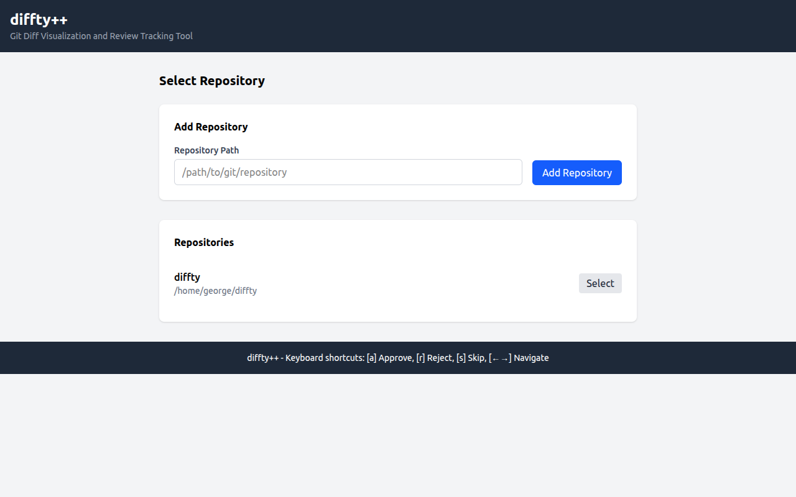
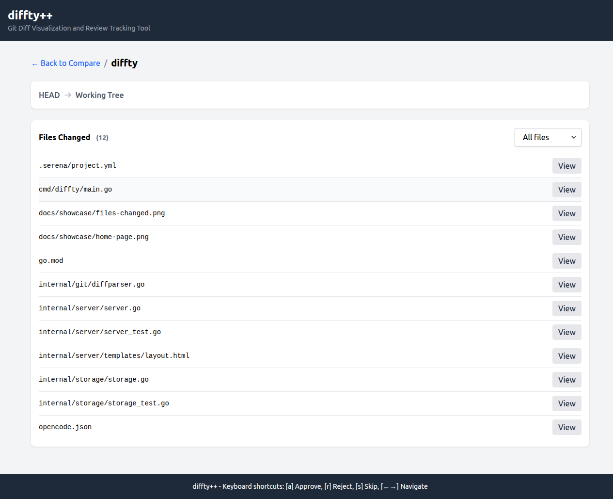
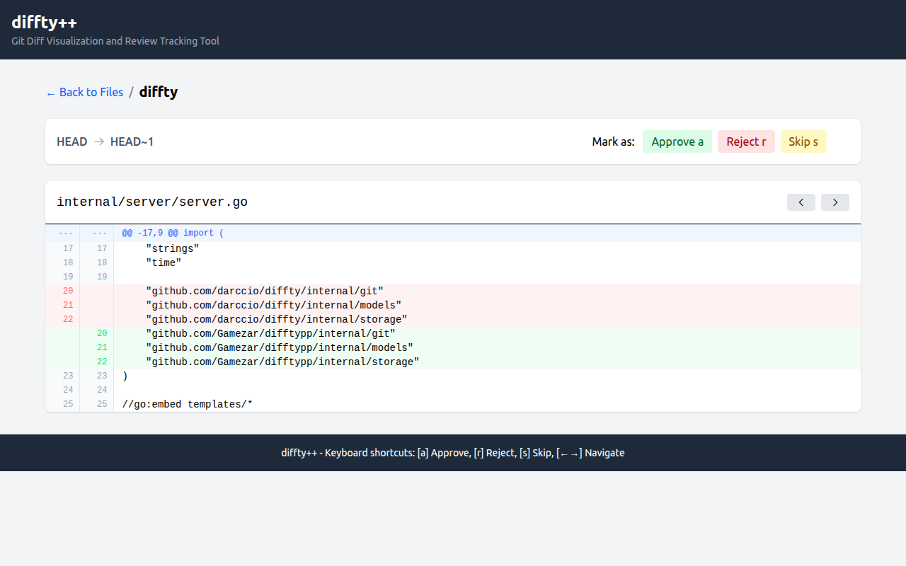

# diffty++ - Git Diff Visualization and Review Tracking Tool

diffty++ is a web-based tool designed to streamline code review processes by providing enhanced diff visualization and lightweight review workflows for Git repositories. The tool focuses on developer ergonomics with keyboard-driven navigation while maintaining compatibility with standard Git workflows.

diffty++ is a fork of [diffty](https://github.com/darccio/diffty).

## Features

- **Enhanced Diff Visualization**: Side-by-side and unified diff views with syntax highlighting
- **Multi-Repository Support**: Select and switch between multiple repositories through the UI
- **Review Workflow**: Mark files as approved, rejected, or skipped
- **Keyboard-Centric Navigation**: Efficient keyboard shortcuts for all operations
- **Review State Persistence**: Save and resume reviews across sessions
- **Git Integration**: Works with any Git repository
- **Multiple Diff Modes**: Compare branches, commits, staged changes, or unstaged working tree modifications

## Screenshots

### Home Page



### Files Changed



### Diff View



## Installation

### Requirements

- Go 1.22+
- Git 2.30+

### Building from Source

1. Clone the repository:
   ```bash
   git clone https://github.com/Gamezar/difftypp.git
   cd difftypp
   ```

2. Build the binary:
   ```bash
   go build -o difftypp ./cmd/diffty
   ```

3. (Optional) Install the binary:
   ```bash
   go install ./cmd/diffty
   ```

## Usage

### Basic Usage

Start the diffty++ server:

```bash
difftypp --port 10101
```

Then open http://localhost:10101 in your web browser. From there, you can:

1. Add repositories through the UI
2. Select repositories to review
3. Choose branches to compare, or view staged/unstaged changes
4. Review changes file by file

### Command-Line Options

- `--port`: Port to run the server on (default: 10101)

### Keyboard Shortcuts

| Key | Action |
|-----|--------|
| `a` | Approve |
| `r` | Reject |
| `s` | Skip |
| `←/→` | Navigate files |

## How It Works

diffty++ uses Git command-line tools to generate diffs and presents them in a web interface. You can add and select repositories through the UI, then compare branches, view commit diffs, or inspect staged/unstaged changes. Review state is persisted per repository in JSON files at `$HOME/.difftypp/`.

## Testing

diffty++ includes comprehensive testing to ensure reliability:

- **Unit Tests**: Tests for core functionality in each package (`git`, `storage`, `server`)
- **Mock-Based Testing**: Interfaces are mocked to allow isolated testing
- **HTTP Testing**: Server handlers are tested using Go's httptest package

Run the tests with:

```bash
go test ./...
```

## Contributing

Contributions are welcome! Please feel free to submit a Pull Request.

## License

This project is licensed under the AGPL License - see the LICENSE file for details.
