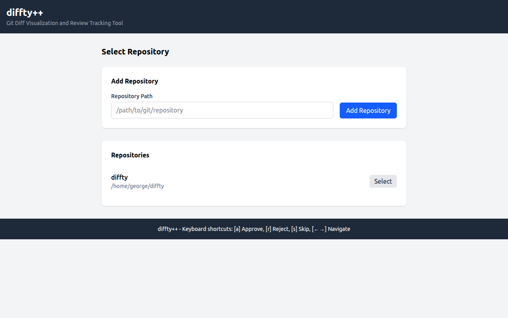
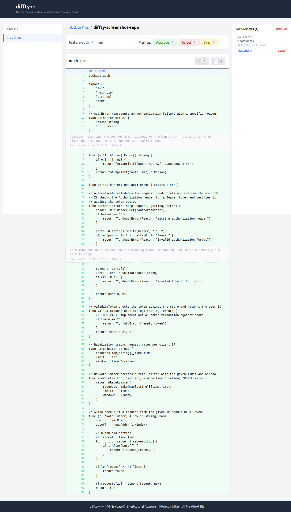

# diffty++ - Git Diff Visualization and Review Tracking Tool

diffty++ is a web-based tool designed to streamline code review processes by providing enhanced diff visualization and lightweight review workflows for Git repositories. The tool focuses on developer ergonomics with keyboard-driven navigation while maintaining compatibility with standard Git workflows.

diffty++ is a fork of [diffty](https://github.com/darccio/diffty).

## Differences from diffty

diffty++ extends the original diffty with the following additions:

- **Multi-mode diff comparison**: Compare branches, arbitrary commits, staged changes, or unstaged working tree modifications via a tabbed UI.
- **Inline review comments**: GitHub PR-style inline comments with line selection, comment resolution, markdown export, and review submission flow.
- **Past reviews sidebar**: Right-side panel showing previous review sessions for the same branch pair, with inline faded rendering of past comments on the current diff, "View original" links back to the original commit pair, and per-review or bulk deletion.
- **File explorer**: Browse the filesystem to select repositories through a modal dialog with breadcrumb navigation, git repository detection, and directory filtering.

## Features

- **Enhanced Diff Visualization**: Side-by-side and unified diff views with syntax highlighting
- **Multi-Repository Support**: Select and switch between multiple repositories through the UI
- **File Explorer**: Browse the filesystem visually to find and select repositories instead of typing paths
- **Sidebar Navigation**: Persistent file list sidebar with status indicators (approved/rejected/skipped/unreviewed), click-to-navigate, and auto-redirect to the first changed file
- **Back Navigation**: Stack-based file history with per-file scroll position tracking — press Backspace or click the back button to return to the previous file at the exact scroll position you left
- **Review Workflow**: Mark files as approved, rejected, or skipped
- **Past Reviews**: View previous review sessions for the same branch pair in a right-side sidebar, with past comments rendered inline (faded) on the current diff. Navigate back to the original diff via "View original", or delete individual/all past reviews.
- **Keyboard-Centric Navigation**: Efficient keyboard shortcuts for all operations
- **Review State Persistence**: Save and resume reviews across sessions
- **Git Integration**: Works with any Git repository
- **Multiple Diff Modes**: Compare branches, commits, staged changes, or unstaged working tree modifications

## Screenshots

### Home Page



### Past Reviews



## Installation

### Requirements

- Go 1.22+
- Git 2.30+

### Building from Source

1. Clone the repository:
   ```bash
   git clone https://github.com/Gamezar/difftypp.git
   cd difftypp
   ```

2. Build the binary:
   ```bash
   go build -o difftypp ./cmd/diffty
   ```

3. (Optional) Install the binary:
   ```bash
   go install ./cmd/diffty
   ```

## Usage

### Basic Usage

Start the diffty++ server:

```bash
difftypp --port 10101
```

Then open http://localhost:10101 in your web browser. From there, you can:

1. Browse for a repository or type its path, then add it
2. Select a repository to review
3. Choose branches to compare, or view staged/unstaged changes
4. Review changes file by file

### Command-Line Options

- `--port`: Port to run the server on (default: 10101)

### Keyboard Shortcuts

| Key | Action |
|-----|--------|
| `a` | Approve |
| `r` | Reject |
| `s` | Skip |
| `←/→` | Navigate files |
| `Backspace` | Go back to previous file |

## How It Works

diffty++ uses Git command-line tools to generate diffs and presents them in a web interface. You can add and select repositories through the UI, then compare branches, view commit diffs, or inspect staged/unstaged changes. Review state is persisted per repository in JSON files at `$HOME/.difftypp/`.

### File Explorer

Click **Browse** next to the repository path input to open the file explorer. The explorer lists directories starting from your home folder. Git repositories appear first, marked with a badge. Click any directory to navigate into it, use the breadcrumb bar to jump back, or press Escape to close. Click **Select** to fill the path input with the current directory.

## Testing

diffty++ includes comprehensive testing to ensure reliability:

- **Go tests**: Unit tests for core functionality in each package (`git`, `storage`, `server`) with mock-based isolation and HTTP testing via Go's httptest package
- **TypeScript tests**: Frontend unit tests using [Vitest](https://vitest.dev/) with jsdom for DOM testing — covers sidebar navigation, cursor persistence, comment system, keyboard navigation, status filtering, and past reviews error handling
- **End-to-end tests**: Browser-based tests using [Playwright](https://playwright.dev/) that spin up a real diffty++ server and exercise full workflows — past reviews lifecycle across branches, staged, unstaged, and commits modes

Run the tests:

```bash
# Go tests
go test ./...

# TypeScript tests
cd web && npm test

# End-to-end tests (requires Playwright browsers installed)
cd web && npm run test:e2e
```

## Contributing

Contributions are welcome! Please feel free to submit a Pull Request.

## License

This project is licensed under the AGPL License - see the LICENSE file for details.
